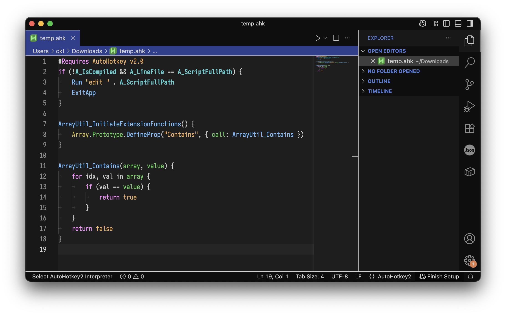

# CKT Dark
Dark theme with clear contrast.

## Style
| Text Effects and Modifier | Type                     | Property  | Function     |
|---------------------------|--------------------------|-----------|--------------|
| Bold                      | Single instance (Object) | Global    | Global       |
| Underlined                | Final                    | Immutable | --           |
| Italic                    | Abstract                 | --        | Asynchronous |

## Color Palette

### Window
#### Grayscale
| Type                 | Code      |
|----------------------|-----------|
| Extra Light          | #EEEEEEFF |
| Light                | #CECECEFF |
| Grey 3               | #8E8E8EFF |
| Grey 2               | #3E3E3EFF |
| Grey 1               | #1E1E1EFF |
| Dark                 | #181818FF |
| Extra Dark           | #0E0E0EFF |
#### Highlight
| Type                 | Code      |
|----------------------|-----------|
| Highlight focus      | #EEEEEE4F |
| Highlight            | #EEEEEE2F |
| Highlight background | #EEEEEE1F |
| Transparent          | #00000000 |
#### Accent
| Type                                 | Code      |
|--------------------------------------|-----------|
| Primary focus                        | #6E9EEEFF |
| Primary                              | #4E7EDEFF |
| Primary background highlighted       | #3E5EAEFF |
| Primary background                   | #2E3E8EFF |
| Secondary focus                      | #9D6DEDFF |
| Secondary                            | #7D4DDDFF |
| Secondary background highlighted     | #5D3DADFF |
| Secondary background                 | #3D2D8DFF |
| Tertiary focus                       | #ED9D6DFF |
| Tertiary                             | #DD7D4DFF |
| Tertiary background highlighted      | #AD5D3DFF |
| Tertiary background                  | #8D3D2DFF |

#### Code
| Color     | Code    | ANSI Color | Token             |
|-----------|---------|------------|-------------------|
| Red 3     | #FF9F9F | B. Red     | Error             |
| Red 2     | #FF6F6F | -          | -                 |
| Red 1     | #EF4F4F | Red        | -                 |
| Orange 3  | #EFAF5F | -          | Primitive Literal |
| Orange 2  | #EF7F4F | -          | -                 |
| Orange 1  | #DF5F1F | -          | -                 |
| Yellow 3  | #CFBF4F | B. Yellow  | Type              |
| Yellow 2  | #BF9F2F | -          | -                 |
| Yellow 1  | #AF7F1F | Yellow     | -                 |
| Green 3   | #5FCF5F | B. Green   | Parameter         |
| Green 2   | #4FAF4F | -          | -                 |
| Green 1   | #3F8F3F | Green      | -                 |
| Cyan 3    | #4FCFCF | B. Cyan    | Property/Field    |
| Cyan 2    | #3FAFAF | -          | -                 |
| Cyan 1    | #2F8F8F | Cyan       | -                 |
| Blue 3    | #6FBFFF | B. Blue    | Function          |
| Blue 2    | #4F9FFF | -          | -                 |
| Blue 1    | #2F7FFF | Blue       | -                 |
| Violet 3  | #AFAFFF | -          | Meta              |
| Violet 2  | #8F8FFF | -          | (TODO/Link)       |
| Violet 1  | #6F6FFF | -          | (Meta Background) |
| Magenta 3 | #FF8FFF | B. Magenta | Keyword           |
| Magenta 2 | #EF6FEF | -          | -                 |
| Magenta 1 | #CF4FCF | Magenta    | -                 |
| White 2   | #EFEFEF | B. White   | -                 |
| White 1   | #CFCFCF | White      | Default           |
| Black 2   | #8F8F8F | B. Black   | Comment           |
| Black 1   | #3F3F3F | Black      | -                 |

#### Rainbow Shade (Reordered Above)
| Code 1    | Code 2    | Code 3    |
|-----------|-----------|-----------|
| #FF8FFF   | #EF6FEF   | #CF4FCF   |
| #AFAFFF   | #8F8FFF   | #6F6FFF   |
| #6FBFFF   | #4F9FFF   | #2F7FFF   |
| #4FCFCF   | #3FAFAF   | #2F8F8F   |
| #5FCF5F   | #4FAF4F   | #3F8F3F   |
| #CFBF4F   | #BF9F2F   | #AF7F1F   |
| #EFAF5F   | #EF7F4F   | #DF5F1F   |
| #FF9F9F   | #FF6F6F   | #EF4F4F   |

#### Status / Version Control
| Type               | Code 1    | Code 2    | Code 3    | Code 4    |
|--------------------|-----------|-----------|-----------|-----------|
| Error / Removed    | #FF0000FF | #DF7F7FFF | #4F0F0FFF | #FF00001F |
| Warning            | #FF7F00FF | #EFBF7FFF | #4F3F0FFF | #FF7F001F |
| Info / Modified    | #FFBF00FF | #DFCF7FFF | #3F3F0FFF | #FFBF001F |
| Debug / Added      | #7FFF7FFF | #7FBF7FFF | #1F2F1FFF | #7FFF7F1F |
| Meta / Conflicting | #007FFFFF | #7FBFFFFF | #0F2F5FFF | #007FFF1F |
| Special / Special  | #FF00FFFF | #BF7FBFFF | #2F1F2FFF | #FF00FF1F |
